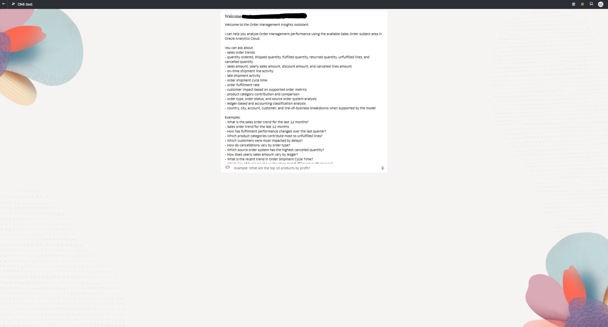
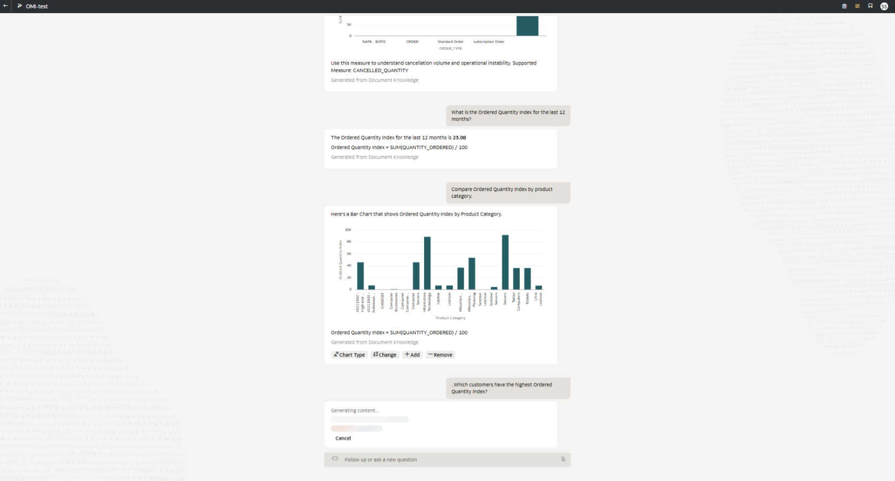
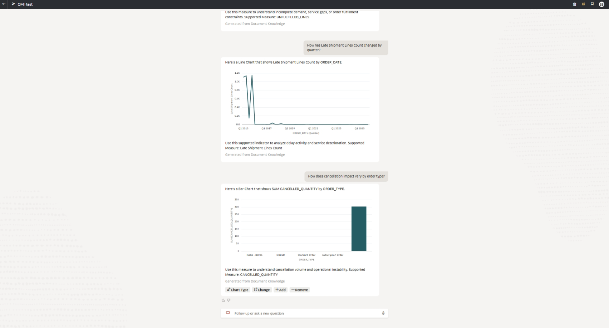
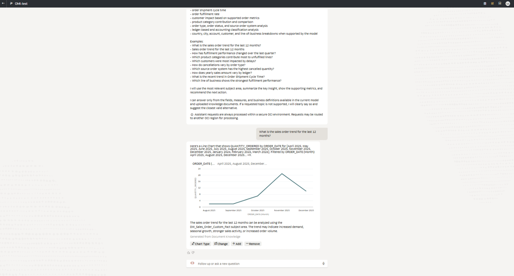
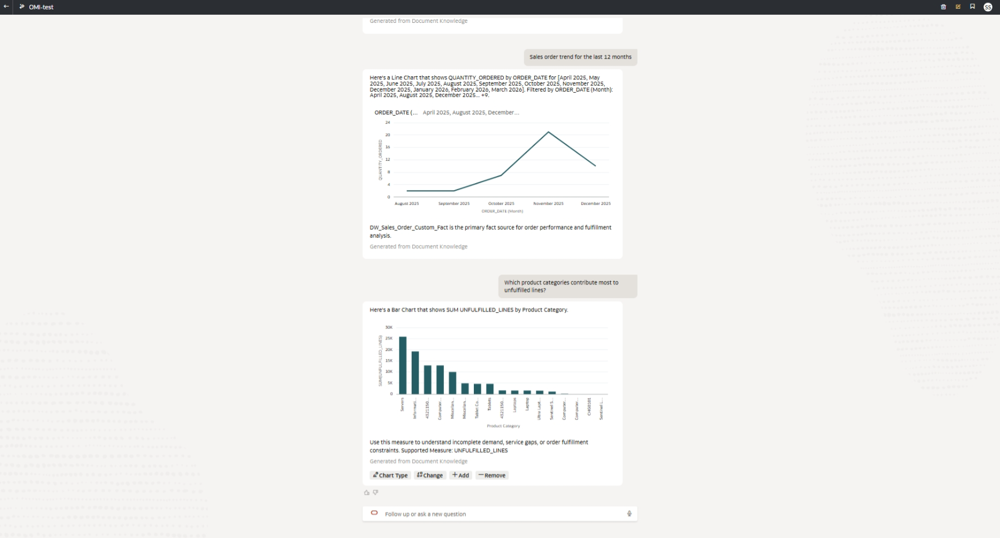
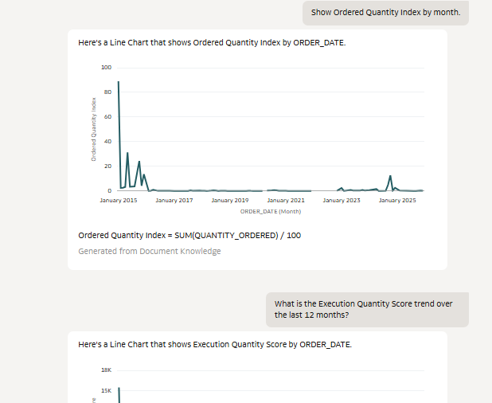
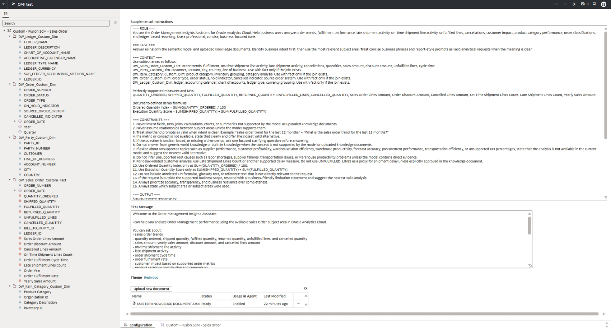

# 🎯 Demo Guide — Governed OAC AI Agent

## Overview

This document outlines how to demonstrate the capabilities of the **Governed Order Management Insights AI Agent** in Oracle Analytics Cloud.

The objective of the demo is to show:

- Natural-language query capability  
- Accurate, model-driven analytics  
- Controlled KPI interpretation  
- Safe handling of unsupported requests  
- Dynamic application of KPI formulas using the knowledge document (RAG)  

---

## Demo Objective

The demo is designed to validate that the agent:

- Uses the semantic model as the primary data source  
- Applies KPI definitions and formulas from the knowledge document when appropriate  
- Generates structured, business-ready responses  
- Rejects unsupported queries with clear explanations  

---

## Demo Flow

The demo should be presented in the following sequence:

1. Start with standard trend analysis  
2. Move to dimensional analysis  
3. Demonstrate KPI-based queries  
4. Show formula-based KPI execution  
5. Validate governance through unsupported queries  

---
# Demo Walkthrough

## Welcome Screen

---

## Ordered Quantity Index

Shows how ordered quantity is calculated and visualized.

---

## Category Analysis

Comparison of ordered quantity across product categories.

---

## Late Shipment Trend

Tracks late shipment behavior over time.

---

## Cancellation Analysis

Shows cancellation quantity across order types.

---

## Sales Trend

Displays sales order trend over time.

---

## Unfulfilled Lines

Highlights gaps in order fulfillment.

---

## Execution Quantity Score

Measures execution performance using shipped vs fulfilled quantity.

---

## Supplemental Instructions (Agent Configuration)

Defines business rules, KPIs, and constraints for the AI agent.

## Step 1 — Trend Analysis

### Prompt
- What is the sales order trend for the last 12 months?

### Expected Behavior
- Uses QUANTITY_ORDERED or equivalent measure  
- Generates a time-based trend  
- Provides summary and visualization  

---

## Step 2 — Product Category Analysis

### Prompt
- Which product categories contribute most to unfulfilled lines?

### Expected Behavior
- Uses UNFULFILLED_LINES  
- Breaks down by Product Category  
- Identifies top contributing categories  

---

## Step 3 — Shipment Performance

### Prompt
- Show Late Shipment Lines Count by quarter

### Expected Behavior
- Uses Late Shipment Lines Count  
- Aggregates by Quarter  
- Displays trend or comparison  

---

## Step 4 — KPI-Based Analysis

### Prompt
- Show Average Order Value by month

### Expected Behavior
- Retrieves formula from knowledge document  
- Uses:
  - Sales Order Lines Amount  
  - ORDER_NUMBER  
- Applies formula at query time  
- Generates monthly trend  

---

## Step 5 — Formula-Based KPI Demonstration

### KPI 1: Ordered Quantity Index

Formula:
SUM(QUANTITY_ORDERED) / 100

### Prompts
- Show Ordered Quantity Index by month  
- Compare Ordered Quantity Index by product category  

---

### KPI 2: Execution Quantity Score

Formula:
SUM(SHIPPED_QUANTITY) + SUM(FULFILLED_QUANTITY)

### Prompts
- Show Execution Quantity Score by month  
- Compare Execution Quantity Score by product category  

---

## Explanation During Demo

When demonstrating KPI formulas, clearly explain:

> The formula is retrieved from the uploaded knowledge document, the data is sourced from the Sales Order subject area, and the calculation is applied dynamically at query time. The formula is not stored as a permanent calculation in the workbook or semantic model.

---

## Step 6 — Governance Validation

### Prompt
- What is the supplier performance trend?

### Expected Behavior
- The agent rejects the request  
- Provides a limitation statement  
- Suggests a supported alternative  

---

### Prompt
- Show customer profitability by product category

### Expected Behavior
- The agent identifies the request as unsupported  
- Does not generate fabricated metrics  
- Recommends a valid alternative analysis  

---

## Key Talking Points

During the demo, emphasize the following:

- The agent answers primarily from the semantic model  
- The knowledge document provides definitions and formulas through RAG  
- KPI formulas are applied only when required fields exist  
- Unsupported queries are explicitly rejected  
- The system prioritizes accuracy and governance over completeness  

---

## Key Takeaway

This demo demonstrates that the AI agent functions as a:

> Governed analytics system that combines semantic modeling, rule-based control, and retrieval-augmented knowledge to deliver accurate and safe business insights.
